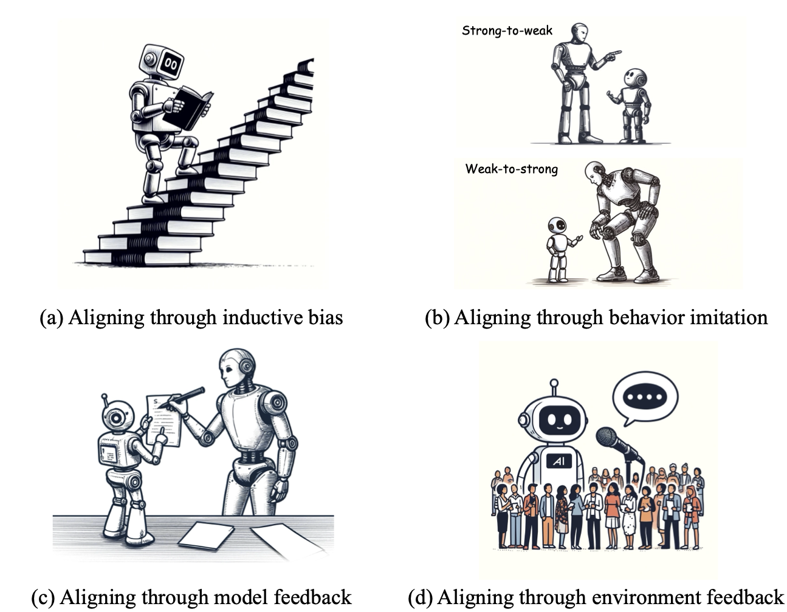

# Awesome Automated Alignment

<div align="center">


[[arXiv paper link (updated monthly)]](https://arxiv.org/abs/2406.01252)
[[CDN paper link (updated nightly)]](https://lxylab.oss-cn-shanghai.aliyuncs.com/automated_alignment/AutoAlign.pdf)
</div>

This is a collection of papers and other resources for scalable automated alignment, which corresponds to the survey paper **Towards Scalable Automated Alignment of LLMs: A Survey**. 
We will update the survey content and this repo regularly, and we very much welcome suggestions of any kind.

## 📢 News 

**[June 4, 2024]** The first preprint version of this survey is released. Since many of the topics covered in this paper are rapidly evolving, we anticipate updating this repository and paper at a relatively fast pace.

## Citation

If you find our survey or repo useful, please consider citing:

```
@article{AutomatedAlignmentSurvey,
    title={Towards Scalable Automated Alignment of LLMs: A Survey},
    author={Boxi Cao, Keming Lu, Xinyu Lu, Jiawei Chen, Mengjie Ren, Hao Xiang, Peilin Liu, Yaojie Lu, Ben He, Xianpei Han, Le Sun, Hongyu Lin, and Bowen Yu},
    year={2024},
    journal={arXiv preprint arXiv:2406.01252},
    url={https://arxiv.org/abs/2406.01252}
}
```

## Abstract

Alignment is the most critical step in building large language models (LLMs) that meet human needs. 
With the rapid development of LLMs gradually surpassing human capabilities, traditional alignment methods based on human-annotation are increasingly unable to meet the scalability demands. Therefore, there is an urgent need to explore new sources of automated alignment signals and technical approaches. In this paper, we systematically review the recently emerging methods of automated alignment, attempting to explore how to achieve effective, scalable, automated alignment once the capabilities of LLMs exceed those of humans. 
Specifically, we categorize existing automated alignment methods into 4 major categories based on the sources of alignment signals and discuss the current status and potential development of each category. 
Additionally, we explore the underlying mechanisms that enable automated alignment and discuss the essential factors that make automated alignment technologies feasible and effective from the fundamental role of alignment.

## Table of Contents

- [Aligning through inductive bias](#1-aligning-through-inductive-bias)

- [Aligning through behaviour imitation](#2-aligning-through-behaviour-imitation)

- [Aligning through model feedback](#3-aligning-through-model-feedback)

- [Aligning through environment feedback](#4-aligning-through-environment-feedback)

- [Underlying Mechanism of Automated Alignment](#5-underlying-mechanism-of-automated-alignment)

## Paper List

### 1. Aligning through inductive bias

#### 1.1 Uncertainty Filtering

- **Semi-supervised Learning by Entropy Minimization.** *Yves Gr et al.* NIPS 2004. [[paper](https://proceedings.neurips.cc/paper/2004/hash/96f2b50b5d3613adf9c27049b2a888c7-Abstract.html)]

- **Pseudo-label: The simple and efficient semi-supervised learning method for deep neural networks.** *Lee et al.* Workshop on challenges in representation learning, ICML 2013. [[paper](https://openreview.net/pdf?id=3iGjh_NmoG)]

- **Revisiting Self-Training for Neural Sequence Generation.** *Junxian He et al.* ICLR 2020. [[paper](https://openreview.net/forum?id=SJgdnAVKDH)]

- **Self-Consistency Improves Chain of Thought Reasoning in Language Models.** *Wang et al.* ICLR 2023. [[Paper](https://openreview.net/forum?id=1PL1NIMMrw)]

- **Large Language Models Can Self-Improve.** *Huang et al.* EMNLP 2023. [[Paper](https://openreview.net/forum?id=uuUQraD4XX)]

- **West-of-N: Synthetic Preference Generation for Improved Reward Modeling.** *Pace et al.* arXiv 2024. [[Paper](https://arxiv.org/abs/2401.12086)]

- **Quiet-STaR: Language models can teach themselves to think before speaking.** *Zelikman et al.* arXiv 2024. [[paper](https://arxiv.org/abs/2403.09629)]

#### 1.2 Self-Judge / Critic / Refine

- **Constitutional AI: Harmlessness from AI feedback.** *Bai et al.* arXiv 2022. [[paper](https://arxiv.org/abs/2212.08073)]

- **Tree of Thoughts: Deliberate Problem Solving with Large Language Models.** *Yao et al.* NeurIPS 2023. [[Paper](https://openreview.net/forum?id=5Xc1ecxO1h)][[Code](https://github.com/princeton-nlp/tree-of-thought-llm)][[Video](https://nips.cc/virtual/2023/oral/73874)]

- **Large Language Models are reasoners with Self-Verification.** *Weng et al.* Findings of EMNLP 2023. [[Paper](https://aclanthology.org/2023.findings-emnlp.167.pdf)][[Code](https://github.com/WENGSYX/Self-Verification)]

- **Self-rewarding language models.** *Yuan et al.* arXiv 2024. [[paper](https://arxiv.org/abs/2401.10020)]

- **Direct language model alignment from online AI feedback.** *Guo et al.* arXiv 2024. [[paper](https://arxiv.org/abs/2402.04792)]

#### 1.3 Context Distillation

- **A general language assistant as a laboratory for alignment.** *Askell et al.* arXiv 2021 [[Paper](https://arxiv.org/abs/2112.00861)]

- **LLaMA: Open and Efficient Foundation Language Models.** *Hugo Touvron et al.* arXiv 2023. [[Paper](https://arxiv.org/abs/2302.13971v1)] [[Code](https://github.com/meta-llama/llama)]

- **Principle-Driven Self-Alignment of Language Models from Scratch with Minimal Human Supervision.** *Sun et al.* NIPS 2023. [[paper](https://proceedings.neurips.cc/paper_files/paper/2023/file/0764db1151b936aca59249e2c1386101-Paper-Conference.pdf)]

- **Propagating Knowledge Updates to LMs Through Distillation.** *Shankar Padmanabhan et al.* NIPS 2023. [[paper](https://openreview.net/forum?id=DFaGf3O7jf)]

- **RLCD: Reinforcement Learning from Contrastive Distillation for LM Alignment.** *Kevin Yang et al.* ICLR 2024. [[paper](https://openreview.net/forum?id=v3XXtxWKi6)]

- **The Unlocking Spell on Base LLMs:  Rethinking Alignment via In-Context Learning.** *Lin et al.* ICLR 2024. [[paper](https://openreview.net/forum?id=wxJ0eXwwda)]


#### 1.4 Task Decompsition

- **Supervising strong learners by amplifying weak experts.** *Christiano et al.* arXiv 2018. [[paper](https://arxiv.org/abs/1810.08575)]

- **Recursively summarizing books with human feedback.** *Wu et al.* arXiv 2021. [[paper](https://arxiv.org/abs/2109.10862)]

- **Least-to-Most Prompting Enables Complex Reasoning in Large Language Models.** *Denny Zhou et al.* ICLR 2023. [[paper](https://openreview.net/forum?id=WZH7099tgfM)]

- **Chain-of-Thought Reasoning is a Policy Improvement Operator.** *Hugh Zhang et al.* NeurIPS 2023 Workshop on Instruction Tuning and Instruction Following 2023. [[paper](https://openreview.net/forum?id=bH64KCBzqS)]

- **Plan-and-Solve Prompting: Improving Zero-Shot Chain-of-Thought Reasoning by Large Language Models.** *Wang et al.* ACL 2023. [[paper](https://aclanthology.org/2023.acl-long.147)]

#### 1.5 Self-play

- **A general reinforcement learning algorithm that masters chess, shogi, and Go through self-play.** *Silver et al.* Science 2018. [[paper](https://www.science.org/doi/10.1126/science.aar6404)]

##### 1.5.1 Generator-Discriminator

- **The Consensus Game: Language Model Generation via Equilibrium Search.** *Athul Paul Jacob et al.* ICLR 2024. [[paper](https://openreview.net/forum?id=n9xeGcI4Yg)]

- **Adversarial Preference Optimization: Enhancing Your Alignment via RM-LLM Game** *Cheng et al.* ACL 2024. [[paper](https://arxiv.org/abs/2311.08045)]

- **Self-play fine-tuning converts weak language models to strong language models.** *Chen et al.* arXiv 2024. [[paper](https://arxiv.org/abs/2401.01335)]

##### 1.5.2 Debate

- **AI safety via debate.** *Irving et al.* arXiv 2018. [[paper](https://arxiv.org/abs/1805.00899)]

- **Scalable AI safety via doubly-efficient debate.** *Brown-Cohen et al.* arXiv 2023. [[paper](https://arxiv.org/abs/2311.14125)]

- **Improving language model negotiation with self-play and in-context learning from ai feedback.** *Fu et al.* arXiv 2023. [[paper](https://arxiv.org/abs/2305.10142)]

- **Debating with More Persuasive LLMs Leads to More Truthful Answers.** *Khan et al.* arXiv 2024. [[paper](https://arxiv.org/abs/2402.06782)]

- **Self-playing Adversarial Language Game Enhances LLM Reasoning.** *Cheng et al.* arXiv 2024. [[paper](https://arxiv.org/abs/2404.10642)]

- **Red teaming game: A game-theoretic framework for red teaming language models.** *Ma et al.* arXiv 2023. [[paper](https://arxiv.org/abs/2310.00322)]

### 2. Aligning through behaviour imitation

#### 2.1 Instruction Construction

##### 2.1.1 In-Context Generation

* **Unnatural Instructions: Tuning Language Models with (Almost) No Human Labor.** *Honovich et al.* Proceedings of the 61st Annual Meeting of the Association for Computational Linguistics (Volume 1: Long Papers) 2023. [[paper](https://aclanthology.org/2023.acl-long.806)]

* **Stanford Alpaca: An Instruction-following LLaMA model.** *Rohan Taori et al.* GitHub repository 2023. [[code](https://github.com/tatsu-lab/stanford_alpaca)]

* **Self-Instruct: Aligning Language Models with Self-Generated Instructions.** *Wang et al.* ACL 2023. [[paper](https://aclanthology.org/2023.acl-long.754)]

* **Dynosaur: A Dynamic Growth Paradigm for Instruction-Tuning Data Curation.** *Yin et al.* EMNLP 2023. [[paper](https://aclanthology.org/2023.emnlp-main.245)]

* **Human-Instruction-Free LLM Self-Alignment with Limited Samples.** *Hongyi Guo et al.* arXiv 2024. [[paper](https://arxiv.org/abs/2401.06785)]

* **LLM2LLM: Boosting LLMs with Novel Iterative Data Enhancement.** *Nicholas Lee et al.* arXiv 2024. [[paper](https://arxiv.org/abs/2403.15042)]

* **LaMini-LM: A Diverse Herd of Distilled Models from Large-Scale Instructions.** *Wu et al.* EACL 2024. [[paper](https://aclanthology.org/2024.eacl-long.57)]

##### 2.1.2 Instruction Evolution
* **WizardLM: Empowering Large Pre-Trained Language Models to Follow Complex Instructions.** *Can Xu et al.* ICLR 2024. [[paper](https://openreview.net/forum?id=CfXh93NDgH)]

* **Teaching LLMs to Teach Themselves Better Instructions via Reinforcement Learning.** *Shangding Gu et al.*  2024. [[paper](https://openreview.net/forum?id=wlRp8IdLkN)]

##### 2.1.3 Instruction Backtranslation

* **Self-Alignment with Instruction Backtranslation.** *Xian Li et al.* ICLR 2024. [[paper](https://openreview.net/forum?id=1oijHJBRsT)]

* **LongForm: Effective Instruction Tuning with Reverse Instructions.** *Abdullatif Köksal et al.* arXiv 2024. [[paper](https://arxiv.org/abs/2304.08460)]

#### 2.2 Response-Guided Distillation

##### 2.2.1 Instruction Following

* **Instruction Tuning with GPT-4.** *Baolin Peng et al.* arXiv 2023. [[paper](https://arxiv.org/abs/2304.03277)]

* **Enhancing Chat Language Models by Scaling High-quality Instructional Conversations.** *Ding et al.* EMNLP 2023. [[paper](https://aclanthology.org/2023.emnlp-main.183)]

* **Parrot: Enhancing Multi-Turn Chat Models by Learning to Ask Questions.** *Yuchong Sun et al.* arXiv 2023. [[paper](https://openreview.net/forum?id=Rd4pGjTcTj)]

* **ZeroShotDataAug: Generating and Augmenting Training Data with ChatGPT.** *Solomon Ubani et al.* arXiv 2023. [[paper](https://openreview.net/forum?id=6LLc3ETdrMK)]

* **Baize: An Open-Source Chat Model with Parameter-Efficient Tuning on Self-Chat Data.** *Xu et al.* EMNLP 2023. [[paper](https://aclanthology.org/2023.emnlp-main.385)]

##### 2.2.2 Math

* **WizardMath: Empowering Mathematical Reasoning for Large Language Models via Reinforced Evol-Instruct.** *Haipeng Luo et al.* arXiv 2023. [[paper](https://arxiv.org/abs/2308.09583)]

* **MathGenie: Generating Synthetic Data with Question Back-translation for Enhancing Mathematical Reasoning of LLMs.** *Zimu Lu et al.* arXiv 2024. [[paper](https://arxiv.org/abs/2402.16352)]

* **MetaMath: Bootstrap Your Own Mathematical Questions for Large Language Models.** *Longhui Yu et al.* ICLR 2024. [[paper](https://openreview.net/forum?id=N8N0hgNDRt)]

* **MAmmoTH: Building Math Generalist Models through Hybrid Instruction Tuning.** *Xiang Yue et al.* ICLR 2024. [[paper](https://openreview.net/forum?id=yLClGs770I)]

* **Explanations from Large Language Models Make Small Reasoners Better.** *Shiyang Li et al.* arXiv 2022. [[paper](https://arxiv.org/abs/2210.06726)]

* **Distilling Reasoning Capabilities into Smaller Language Models.** *Shridhar et al.* Findings of ACL 2023. [[paper](https://aclanthology.org/2023.findings-acl.441)]

* **Teaching Small Language Models to Reason.** *Magister et al.* ACL 2023. [[paper](https://aclanthology.org/2023.acl-short.151)]

* **Specializing Smaller Language Models towards Multi-Step Reasoning.** *Yao Fu et al.* arXiv 2023. [[paper](https://arxiv.org/abs/2301.12726)]

* **Large Language Models Are Reasoning Teachers.** *Ho et al.* ACL 2023. [[paper](https://aclanthology.org/2023.acl-long.830)]

* **Distilling Step-by-Step! Outperforming Larger Language Models with Less Training Data and Smaller Model Sizes.** *Hsieh et al.* Findings of ACL 2023. [[paper](https://aclanthology.org/2023.findings-acl.507)]

* **Query and Response Augmentation Cannot Help Out-of-domain Math Reasoning Generalization.** *Chengpeng Li et al.* arXiv 2023. [[paper](https://arxiv.org/abs/2310.05506)]

##### 2.2.3 Code

* **Code Alpaca: An Instruction-following LLaMA model for code generation.** *Sahil Chaudhary et al.* GitHub repository 2023. [[code](https://github.com/sahil280114/codealpaca)]

* **WizardCoder: Empowering Code Large Language Models with Evol-Instruct.** *Ziyang Luo et al.* ICLR 2024. [[paper](https://openreview.net/forum?id=UnUwSIgK5W)]

* **MathCoder: Seamless Code Integration in LLMs for Enhanced Mathematical Reasoning.** *Ke Wang et al.* ICLR 2024. [[paper](https://openreview.net/forum?id=z8TW0ttBPp)]

* **Magicoder: Source Code Is All You Need.** *Yuxiang Wei et al.* arXiv 2023. [[paper](https://arxiv.org/abs/2312.02120)]

* **WaveCoder: Widespread And Versatile Enhanced Instruction Tuning with Refined Data Generation.** *Zhaojian Yu et al.* arXiv 2024. [[paper](https://arxiv.org/abs/2312.14187)]

* **MARIO: MAth Reasoning with code Interpreter Output -- A Reproducible Pipeline.** *Minpeng Liao et al.* arXiv 2024. [[paper](https://arxiv.org/abs/2401.08190)]

* **OpenCodeInterpreter: Integrating Code Generation with Execution and Refinement.** *Tianyu Zheng et al.* arXiv 2024. [[paper](https://arxiv.org/abs/2402.14658)]

* **CodeUltraFeedback: An LLM-as-a-Judge Dataset for Aligning Large Language Models to Coding Preferences.** *Martin Weyssow et al.* arXiv 2024. [[paper](https://arxiv.org/abs/2403.09032)]

##### 2.2.4 Agent

* **Gorilla: Large Language Model Connected with Massive APIs.** *Shishir G. Patil et al.* arXiv 2023. [[paper](https://arxiv.org/abs/2305.15334)]

* **GPT4Tools: Teaching Large Language Model to Use Tools via Self-instruction.** *Yang et al.* NIPS 2023. [[paper](https://proceedings.neurips.cc/paper_files/paper/2023/file/e393677793767624f2821cec8bdd02f1-Paper-Conference.pdf)]

* **Toolalpaca: Generalized tool learning for language models with 3000 simulated cases.** *Tang et al.* arXiv 2023. [[paper](https://arxiv.org/abs/2306.05301)]

* **ToolLLM: Facilitating Large Language Models to Master 16000+ Real-world APIs.** *Yujia Qin et al.* arXiv 2023. [[paper](https://arxiv.org/abs/2307.16789)]

* **Graph-ToolFormer: To Empower LLMs with Graph Reasoning Ability via Prompt Augmented by ChatGPT.** *Jiawei Zhang et al.* arXiv 2023. [[paper](https://arxiv.org/abs/2304.11116)]

* **FireAct: Toward Language Agent Fine-tuning.** *Baian Chen et al.* arXiv 2023. [[paper](https://arxiv.org/abs/2310.05915)]

* **AgentTuning: Enabling Generalized Agent Abilities for LLMs.** *Aohan Zeng et al.* arXiv 2023. [[paper](https://arxiv.org/abs/2310.12823)]

* **ReST meets ReAct: Self-Improvement for Multi-Step Reasoning LLM Agent.** *Renat Aksitov et al.* arXiv 2023. [[paper](https://arxiv.org/abs/2312.10003)]

* **ReAct Meets ActRe: When Language Agents Enjoy Training Data Autonomy.** *Zonghan Yang et al.* arXiv 2024. [[paper](https://arxiv.org/abs/2403.14589)]

* **Trial and Error: Exploration-Based Trajectory Optimization for LLM Agents.** *Yifan Song et al.* arXiv 2024. [[paper](https://arxiv.org/abs/2403.02502)]


#### 2.3 Preference-Guided Distillation

* **Super-NaturalInstructions: Generalization via Declarative Instructions on 1600+ NLP Tasks.** *Wang et al.* EMNLP 2022. [[paper](https://aclanthology.org/2022.emnlp-main.340)]

* **UltraFeedback: Boosting Language Models with High-quality Feedback.** *Ganqu Cui et al.* ICLR 2024. [[paper](https://openreview.net/forum?id=pNkOx3IVWI)]

* **Preference Ranking Optimization for Human Alignment.** *Song et al.* arXiv 2023. [[paper](https://arxiv.org/abs/2306.17492)]

* **A general theoretical paradigm to understand learning from human preferences.** *Azar et al.* AISTATS 2024. [[paper](https://arxiv.org/abs/2310.12036)]

* **CycleAlign: Iterative Distillation from Black-box LLM to White-box Models for Better Human Alignment.** *Jixiang Hong et al.* arXiv 2023. [[paper](https://arxiv.org/abs/2310.16271)]

* **Zephyr: Direct Distillation of LM Alignment.** *Lewis Tunstall et al.* arXiv 2023. [[paper](https://arxiv.org/abs/2310.16944)]

* **Aligning Large Language Models through Synthetic Feedback.** *Kim et al.* EMNLP 2023. [[paper](https://aclanthology.org/2023.emnlp-main.844)]

* **MetaAligner: Conditional Weak-to-Strong Correction for Generalizable Multi-Objective Alignment of Language Models.** *Kailai Yang et al.* arXiv 2024. [[paper](https://arxiv.org/abs/2403.17141)]

* **OpenChat: Advancing Open-source Language Models with Mixed-Quality Data.** *Guan Wang et al.* ICLR 2024. [[paper](https://openreview.net/forum?id=AOJyfhWYHf)]

* **Safer-Instruct: Aligning Language Models with Automated Preference Data.** *Taiwei Shi et al.* arXiv 2024. [[paper](https://openreview.net/forum?id=kXS9ahdyHrky)]

* **Aligner: Achieving Efficient Alignment through Weak-to-Strong Correction.** *Jiaming Ji et al.* arXiv 2024. [[paper](https://arxiv.org/abs/2402.02416)]

* **ITERALIGN: Iterative constitutional alignment of large language models.** *Chen et al.* arXiv 2024. [[paper](https://arxiv.org/abs/2403.18341)]

#### 2.4 Weak-to-Strong Alignment

* **Supervising strong learners by amplifying weak experts.** *Christiano et al.* arXiv 2018. [[paper](https://arxiv.org/abs/1810.08575)]

* **Weak-to-Strong Generalization: Eliciting Strong Capabilities With Weak Supervision.** *Collin Burns et al.* arXiv 2023. [[paper](https://arxiv.org/abs/2312.09390)]

* **The Unreasonable Effectiveness of Easy Training Data for Hard Tasks.** *Peter Hase et al.* arXiv 2024. [[paper](https://arxiv.org/abs/2401.06751)]

* **Superfiltering: Weak-to-Strong Data Filtering for Fast Instruction-Tuning.** *Ming Li et al.* arXiv 2024. [[paper](https://arxiv.org/abs/2402.00530)]

* **Co-Supervised Learning: Improving Weak-to-Strong Generalization with Hierarchical Mixture of Experts.** *Yuejiang Liu et al.* arXiv 2024. [[paper](https://arxiv.org/abs/2402.15505)]

* **Easy-to-Hard Generalization: Scalable Alignment Beyond Human Supervision.** *Zhiqing Sun et al.* arXiv 2024. [[paper](https://arxiv.org/abs/2403.09472)]

* **Self-Supervised Alignment with Mutual Information: Learning to Follow Principles without Preference Labels.** *Jan-Philipp Fränken et al.* arXiv 2024. [[paper](https://arxiv.org/abs/2404.14313)]

* **Weak-to-Strong Extrapolation Expedites Alignment.** *Chujie Zheng et al.* arXiv 2024. [[paper](https://arxiv.org/abs/2404.16792)]

* **Quantifying the Gain in Weak-to-Strong Generalization.** *Moses Charikar et al.* arXiv 2024. [[paper](https://arxiv.org/abs/2405.15116v1)]

* **Theoretical Analysis of Weak-to-Strong Generalization.** *Hunter Lang et al.* arXiv 2024. [[paper](https://arxiv.org/abs/2405.16043)]

* **A statistical framework for weak-to-strong generalization.** *Seamus Somerstep et al.* arXiv 2024. [[paper](https://arxiv.org/abs/2405.16236)]

### 3. Aligning through model feedback

#### 3.1 Scalar Reward

- **Deep Reinforcement Learning from Human Preferences.** *Paul F. Christiano et al.* NeurIPS 2017. [[paper](https://proceedings.neurips.cc/paper/2017/hash/d5e2c0adad503c91f91df240d0cd4e49-Abstract.html)]

- **Learning to summarize with human feedback.** *Nisan Stiennon et al.* NeurIPS 2020. [[paper](https://proceedings.neurips.cc/paper/2020/hash/1f89885d556929e98d3ef9b86448f951-Abstract.html)]

- **A general language assistant as a laboratory for alignment.** *Askell et al.* arXiv 2021. [[paper](https://arxiv.org/abs/2112.00861)]

- **Constitutional ai: Harmlessness from ai feedback.** *Bai et al.* arXiv 2022. [[paper](https://arxiv.org/abs/2212.08073)]

- **Training language models to follow instructions with human feedback** *Ouyang et al.* NeurIPS 2022. [[Paper](https://proceedings.neurips.cc/paper_files/paper/2022/hash/b1efde53be364a73914f58805a001731-Abstract-Conference.html)]

- **Training a helpful and harmless assistant with reinforcement learning from human feedback.** *Bai et al.* arXiv 2022. [[paper](https://arxiv.org/abs/2204.05862)]

* **Quark: Controllable Text Generation with Reinforced Unlearning.** *Ximing Lu et al.* arXiv 2022. [[paper](https://arxiv.org/abs/2205.13636)]

- **Rewarded soups: towards Pareto-optimal alignment by interpolating weights fine-tuned on diverse rewards.** *Alex et al.* NeurIPS 2023. [[paper](https://openreview.net/forum?id=lSbbC2VyCu)]

- **Fine-Grained Human Feedback Gives Better Rewards for Language Model Training.** *Zeqiu Wu et al.* NeurIPS 2023. [[paper](https://openreview.net/forum?id=CSbGXyCswu)]

- **Scaling Laws for Reward Model Overoptimization.** *Gao et al.* ICML 2023. [[paper](https://proceedings.mlr.press/v202/gao23h.html)]

- **Principled Reinforcement Learning with Human Feedback from Pairwise or K-wise Comparisons.** *Zhu et al.* ICML 2023. [[paper](https://proceedings.mlr.press/v202/zhu23f.html)]

- **Secrets of RLHF in Large Language Models Part I: PPO.** *Rui Zheng et al.* arXiv 2023. [[paper](https://arxiv.org/abs/2307.04964)]

- **RLAIF: Scaling Reinforcement Learning from Human Feedback with AI Feedback.** *Harrison Lee et al.* arXiv 2023. [[paper](https://arxiv.org/abs/2309.00267)]

- **Zephyr: Direct Distillation of LM Alignment.** *Lewis Tunstall et al.* arXiv 2023. [[paper](https://arxiv.org/abs/2310.16944)]

* **Scaling Relationship on Learning Mathematical Reasoning with Large Language Models.** *Zheng Yuan et al.* arXiv 2023. [[paper](https://arxiv.org/abs/2308.01825)]

* **RAFT: Reward rAnked FineTuning for Generative Foundation Model Alignment.** *Hanze Dong et al.* TMLR 2023. [[paper](https://openreview.net/forum?id=m7p5O7zblY)]

* **RRHF: Rank Responses to Align Language Models with Human Feedback.** *Hongyi Yuan et al.* NIPS 2023. [[paper](https://openreview.net/forum?id=EdIGMCHk4l)]

- **CycleAlign: Iterative Distillation from Black-box LLM to White-box Models for Better Human Alignment.** *Jixiang Hong et al.* arXiv 2023. [[paper](https://arxiv.org/abs/2310.16271)]

- **SALMON: Self-Alignment with Principle-Following Reward Models.** *Zhiqing Sun et al.* ICLR 2023. [[paper](https://openreview.net/forum?id=xJbsmB8UMx)]

- **Aligning Large Language Models through Synthetic Feedback.** *Kim et al.* EMNLP 2023. [[paper](https://aclanthology.org/2023.emnlp-main.844)]

- **Reward-Augmented Decoding: Efficient Controlled Text Generation With a Unidirectional Reward Model.** *Deng et al.* EMNLP 2023. [[paper](https://aclanthology.org/2023.emnlp-main.721)]

- **Critic-Driven Decoding for Mitigating Hallucinations in Data-to-text Generation.** *Lango et al.* EMNLP 2023. [[paper](https://aclanthology.org/2023.emnlp-main.172)]

- **Large Language Models Are Not Fair Evaluators.** *Wang et al.* arXiv 2023. [[paper](https://arxiv.org/abs/2305.17926)]

- **Direct language model alignment from online ai feedback.** *Guo et al.* arXiv 2024. [[paper](https://arxiv.org/abs/2402.04792)]

- **West-of-N: Synthetic Preference Generation for Improved Reward Modeling.** *Pace et al.* arXiv 2024. [[paper](https://arxiv.org/abs/2401.12086)]

- **Self-rewarding language models.** *Yuan et al.* arXiv 2024. [[paper](https://arxiv.org/abs/2401.10020)]

- **Safer-Instruct: Aligning Language Models with Automated Preference Data.** *Taiwei Shi et al.* arXiv 2024. [[paper](https://arxiv.org/abs/2311.08685)]

- **Controlled Decoding from Language Models.** *Sidharth Mudgal et al.* arXiv 2024. [[paper](https://arxiv.org/abs/2310.17022)]

- **Direct Large Language Model Alignment Through Self-Rewarding Contrastive Prompt Distillation.** *Aiwei Liu et al.* arXiv 2024. [[paper](https://arxiv.org/abs/2402.11907)]

- **Decoding-time Realignment of Language Models.** *Tianlin Liu et al.* arXiv 2024. [[paper](https://arxiv.org/abs/2402.02992)]

- **GRATH: Gradual Self-Truthifying for Large Language Models.** *Weixin Chen et al.* arXiv 2024. [[paper](https://arxiv.org/abs/2401.12292)]

- **RLCD: Reinforcement Learning from Contrastive Distillation for LM Alignment.** *Kevin Yang et al.* ICLR 2024. [[paper](https://openreview.net/forum?id=v3XXtxWKi6)]

- **Judging llm-as-a-judge with mt-bench and chatbot arena.** *Zheng et al.* NIPS 2024. [[paper](https://proceedings.neurips.cc/paper_files/paper/2023/hash/91f18a1287b398d378ef22505bf41832-Abstract-Datasets_and_Benchmarks.html)]

- **On Diversified Preferences of Large Language Model Alignment.** *Dun Zeng et al.* arXiv 2024. [[paper](https://arxiv.org/abs/2312.07401)]

- **Improving Large Language Models via Fine-grained Reinforcement Learning with Minimum Editing Constraint.** *Zhipeng Chen et al.* arXiv 2024. [[paper](https://arxiv.org/abs/2401.06081)]


#### 3.2 Binary Verifier

* **Training Verifiers to Solve Math Word Problems.** *Karl Cobbe et al.* arXiv 2021. [[paper](https://arxiv.org/abs/2110.14168)]

* **Solving math word problems with process- and outcome-based feedback.** *Jonathan Uesato et al.* arXiv 2022. [[paper](https://arxiv.org/abs/2211.14275)]

* **STaR: Bootstrapping Reasoning With Reasoning.** *Zelikman et al.* NIPS 2022. [[paper](https://proceedings.neurips.cc/paper_files/paper/2022/file/639a9a172c044fbb64175b5fad42e9a5-Paper-Conference.pdf)]

* **Improving Large Language Model Fine-tuning for Solving Math Problems.** *Yixin Liu et al.* arXiv 2023. [[paper](https://arxiv.org/abs/2310.10047)]

* **Making Language Models Better Reasoners with Step-Aware Verifier.** *Li et al.* ACL 2023. [[paper](https://aclanthology.org/2023.acl-long.291)]

* **Let's Verify Step by Step.** *Hunter Lightman et al.* arXiv 2023. [[paper](https://arxiv.org/abs/2305.20050)]

* **Solving Math Word Problems via Cooperative Reasoning induced Language Models.** *Zhu et al.* ACL 2023. [[paper](https://aclanthology.org/2023.acl-long.245)]

* **GRACE: Discriminator-Guided Chain-of-Thought Reasoning.** *Khalifa et al.* Findings of ACL 2023. [[paper](https://aclanthology.org/2023.findings-emnlp.1022)]

* **Let's reward step by step: Step-Level reward model as the Navigators for Reasoning.** *Qianli Ma et al.* arXiv 2023. [[paper](https://arxiv.org/abs/2310.10080)]

* **Beyond Human Data: Scaling Self-Training for Problem-Solving with Language Models.** *Avi Singh et al.* TMLR 2024. [[paper](https://openreview.net/forum?id=lNAyUngGFK)]

* **V-STaR: Training Verifiers for Self-Taught Reasoners.** *Arian Hosseini et al.* arXiv 2024. [[paper](https://arxiv.org/abs/2402.06457)]

* **GLoRe: When, Where, and How to Improve LLM Reasoning via Global and Local Refinements.** *Alex Havrilla et al.* arXiv 2024. [[paper](https://arxiv.org/abs/2402.10963)]

* **InternLM-Math: Open Math Large Language Models Toward Verifiable Reasoning.** *Huaiyuan Ying et al.* arXiv 2024. [[paper](https://arxiv.org/abs/2402.06332)]

* **OVM, Outcome-supervised Value Models for Planning in Mathematical Reasoning.** *Fei Yu et al.* arXiv 2024. [[paper](https://arxiv.org/abs/2311.09724)]

* **DeepSeekMath: Pushing the Limits of Mathematical Reasoning in Open Language Models.** *Zhihong Shao et al.* arXiv 2024. [[paper](https://arxiv.org/abs/2402.03300)]

* **Math-Shepherd: Verify and Reinforce LLMs Step-by-step without Human Annotations.** *Peiyi Wang et al.* arXiv 2024. [[paper](https://arxiv.org/abs/2312.08935)]

* **Multi-step Problem Solving Through a Verifier: An Empirical Analysis on Model-induced Process Supervision.** *Zihan Wang et al.* arXiv 2024. [[paper](https://arxiv.org/abs/2402.02658)]

#### 3.3 Text Critic

* **Training Language Models with Language Feedback.** *Jérémy Scheurer et al.* arXiv 2022. [[paper](https://arxiv.org/abs/2204.14146)]

* **Self-critiquing models for assisting human evaluators.** *Saunders et al.* arXiv 2022. [[paper](https://arxiv.org/abs/2206.05802)]

* **Shepherd: A Critic for Language Model Generation.** *Wang et al.* arXiv 2023. [[paper](https://arxiv.org/abs/2308.04592)]

* **Critique Ability of Large Language Models.** *Liangchen Luo et al.* arXiv 2023. [[paper](https://arxiv.org/abs/2310.04815)]

* **Learning from Natural Language Feedback.** *Angelica Chen et al.* TMLR 2024. [[paper](https://openreview.net/forum?id=xo3hI5MwvU)]

* **Open Source Language Models Can Provide Feedback: Evaluating LLMs' Ability to Help Students Using GPT-4-As-A-Judge.** *Charles Koutcheme et al.* arXiv 2024. [[paper](https://arxiv.org/abs/2405.05253)]

* **Learning From Mistakes Makes LLM Better Reasoner.** *Shengnan An et al.* arXiv 2024. [[paper](https://arxiv.org/abs/2310.20689)]

### 4. Aligning through environment feedback

#### 4.1 Social Interactions

- **Training Socially Aligned Language Models on Simulated Social Interactions.** *Liu et al.* ICLR 2024. [[paper](https://arxiv.org/abs/2305.16960)] [[code](https://github.com/agi-templar/Stable-Alignment)]

- **Self-Alignment of Large Language Models via Monopolylogue-based Social Scene Simulation.** *Pang et al.* ICML 2024. [[paper](https://arxiv.org/pdf/2402.05699)] [[code](https://shuotang123.github.io/MATRIX/)]

- **MoralDial: A Framework to Train and Evaluate Moral Dialogue Systems via Moral Discussions.** *Sun et al.* ACL 2023. [[paper](https://aclanthology.org/2023.acl-long.123.pdf)] [[code](https://github.com/thu-coai/MoralDial)]

- **SOTOPIA-$\pi$: Interactive Learning of Socially Intelligent Language Agents.** *Wang et al.* arXiv 2024. [[paper](https://arxiv.org/abs/2403.08715)] [[code](https://github.com/sotopia-lab/sotopia-pi)]

- **Systematic Biases in LLM Simulations of Debates.** *Taubenfeld et al.* arXiv 2024. [[paper](https://arxiv.org/pdf/2402.04049)]

- **Bootstrapping LLM-based Task-Oriented Dialogue Agents via Self-Talk.** *Ulmer et al.* arXiv 2024 [[paper](https://arxiv.org/abs/2401.05033)]

- **Social Chemistry 101: Learning to Reason about Social and Moral Norms.** *Forbes et al.* EMNLP 2020. [[paper](https://aclanthology.org/2020.emnlp-main.48.pdf)] [[code](https://github.com/mbforbes/social-chemistry-101)]

- **Aligning to Social Norms and Values in Interactive Narratives.** *Prithviraj et al.* NAACL 2022. [[paper](https://aclanthology.org/2022.naacl-main.439.pdf)]

- **The Moral Integrity Corpus: A Benchmark for Ethical Dialogue Systems.** *Ziems et al.* ACL 2022. [[paper](https://aclanthology.org/2022.acl-long.261.pdf)] [[code](https://github.com/SALT-NLP/mic)]

- **Agent Alignment in Evolving Social Norms.** *Li et al.* arXiv 2024. [[paper](https://arxiv.org/abs/2401.04620)]

- **What are human values, and how do we align AI to them?** *Klingefjord et al.* arXiv 2024. [[paper](https://arxiv.org/pdf/2404.10636)]

#### 4.2 Human Collective Intelligence

- **Constitutional AI: Harmlessness from AI Feedback.** *Bai et al.* arXiv 2022. [[paper](https://arxiv.org/abs/2212.08073)] [[code](https://github.com/anthropics/ConstitutionalHarmlessnessPaper)]

- **Collective Constitutional AI: Aligning a Language Model with Public Input.** Huang et al. 2024. [[paper](https://dl.acm.org/doi/10.1145/3630106.3658979)] [[blog](https://www.anthropic.com/news/collective-constitutional-ai-aligning-a-language-model-with-public-input)]

- **Democratic inputs to AI grant program: lessons learned and implementation plans.** OpenAI. 2023. [[blog](https://openai.com/index/democratic-inputs-to-ai-grant-program-update/)]

- **Principle-Driven Self-Alignment of Language Models from Scratch with Minimal Human Supervision.** *Sun et al.* NeurIPS 2023. [[paper](https://arxiv.org/abs/2305.03047)] [[code](https://github.com/IBM/Dromedary)]

- **ConstitutionMaker: Interactively Critiquing Large Language Models by Converting Feedback into Principles.** *Petridis et al.* arXiv 2023. [[paper](https://arxiv.org/abs/2310.15428)]

- **Case Law Grounding: Aligning Judgments of Humans and AI on Socially-Constructed Concepts.** *Chen et al.* arXiv 2023. [[paper](https://arxiv.org/abs/2310.07019)]

- **LeetPrompt: Leveraging Collective Human Intelligence to Study LLMs.** *Santy et al.* arXiv 2024. [[paper](https://openreview.net/pdf?id=1SEXzogsET)]

- **CultureBank: An Online Community-Driven Knowledge Base Towards Culturally Aware Language Technologies.** *Shi et al.* arXiv 2024. [[paper](https://arxiv.org/abs/2404.15238)] [[code](https://github.com/SALT-NLP/CultureBank)]

- **IterAlign: Iterative Constitutional Alignment of Large Language Models.** *Chen et al.* NAACL 2024. [[paper](https://arxiv.org/abs/2403.18341)]

#### 4.3 Tool Execution Feedback

- **Teaching Large Language Models to Self-Debug.** *Chen et al.* ICLR 2024. [[paper](https://openreview.net/pdf?id=KuPixIqPiq)]

- **SelfEvolve: A Code Evolution Framework via Large Language Models.** *Jiang et al.* arXiv 2023. [[paper](https://arxiv.org/abs/2306.02907)]

- **CodeRL: Mastering Code Generation through Pretrained Models and Deep Reinforcement Learning.** *Le et al.* NeurIPS 2022. [[paper](https://arxiv.org/abs/2207.01780)] [[code](https://github.com/salesforce/CodeRL)]

- **CRITIC: Large Language Models Can Self-Correct with Tool-Interactive Critiquing.** *Gou et al.* ICLR 2024. [[paper](https://openreview.net/pdf?id=Sx038qxjek)] [[code](https://github.com/microsoft/ProphetNet/tree/master/CRITIC)]

- **AUTOACT: Automatic Agent Learning from Scratch via Self-Planning.** *Qiao et al.* arXiv 2024. [[paper](https://arxiv.org/abs/2401.05268)] [[code](https://github.com/zjunlp/AutoAct)]

- **LLMs in the Imaginarium: Tool Learning through Simulated Trial and Error.** *Wang et al.* arXiv 2024. [[paper](https://arxiv.org/abs/2403.04746)] [[code](https://github.com/microsoft/simulated-trial-and-error)]

- **Making Language Models Better Tool Learners with Execution Feedback.** *Qiao et al.* NAACL 2024. [[paper](https://arxiv.org/abs/2305.13068)] [[code](https://github.com/zjunlp/TRICE)]

#### 4.4 Embodied Environment

- **Grounding Large Language Models in Interactive Environments with Online Reinforcement Learning.** *Carta et al.* arXiv 2023. [[paper](https://arxiv.org/abs/2302.02662)] [[code](https://github.com/flowersteam/Grounding_LLMs_with_online_RL)]

- **Language Models Meet World Models: Embodied Experiences Enhance Language Models.** *Xiang et al.* NeurIPS 2023. [[paper](https://arxiv.org/abs/2305.10626)] [[code](https://github.com/szxiangjn/world-model-for-language-model?tab=readme-ov-file)]

- **True Knowledge Comes from Practice: Aligning LLMs with Embodied Environments via Reinforcement Learning.** *Tan et al.* arXiv 2024. [[paper](https://arxiv.org/abs/2401.14151)] [[code](https://github.com/WeihaoTan/TWOSOME)]

- **Do As I Can, Not As I Say: Grounding Language in Robotic Affordances.** *Ahn et al.* arXiv 2022. [[paper](https://say-can.github.io/assets/palm_saycan.pdf)] [[code](https://say-can.github.io/)]

- **Voyager: An Open-Ended Embodied Agent with Large Language Models.** *Wang et al.* arXiv 2023. [[paper](https://arxiv.org/abs/2305.16291)] [[code](https://github.com/MineDojo/Voyager)]

- **Trial and Error: Exploration-Based Trajectory Optimization for LLM Agents.** *Song et al.* ACL 2024. [[paper](https://arxiv.org/abs/2403.02502)] [[code](https://github.com/Yifan-Song793/ETO)]

- **Large Language Models as Generalizable Policies for Embodied Tasks.** *Szot et al.* ICLR 2024. [[paper](https://arxiv.org/abs/2310.17722)]

### 5. Underlying Mechanism of Automated Alignment

#### 5.1 Alignment Mechanism

* **LIMA: Less Is More for Alignment.** *Zhou et al.* NIPS 2023. [[paper](https://proceedings.neurips.cc/paper_files/paper/2023/file/ac662d74829e4407ce1d126477f4a03a-Paper-Conference.pdf)]

* **AlpaGasus: Training A Better Alpaca with Fewer Data.** *Chen et al.* arXiv 2023. [[paper](https://arxiv.org/abs/2307.08701)]

* **The False Promise of Imitating Proprietary LLMs.** *Gudib et al.* arXiv 2023. [[paper](https://arxiv.org/abs/2305.15717)]

* **Exploring the Relationship between In-Context Learning and Instruction Tuning.** *Duan et al.* arxiv 2023. [[paper](https://arxiv.org/abs/2311.10367)]

* **Towards Expert-Level Medical Question Answering with Large Language Models.** *Singhal et al.* arXiv 2023. [[paper](https://arxiv.org/abs/2305.09617)]

* **Injecting New Knowledge into Large Language Models via Supervised Fine-Tuning.** *Mecklenburg et al.* arXiv 2024. [[paper](https://arxiv.org/abs/2404.00213)]

* **The Unlocking Spell on Base LLMs:  Rethinking Alignment via In-Context Learning.** *Lin et al.* ICLR 2024. [[paper](https://openreview.net/forum?id=wxJ0eXwwda)]

* **From Language Modeling to Instruction Following: Understanding the Behavior Shift in LLMs after Instruction Tuning.** *Wu et al.* NAACL 2024. [[paper](https://arxiv.org/abs/2310.00492)]

* **Does Fine-Tuning LLMs on New Knowledge Encourage Hallucinations?.** *Gekhman et al.* arXiv 2024. [[paper](https://arxiv.org/abs/2405.05904)]

* **Learning or Self-Aligning? Rethinking Instruction Fine-Tuning.** *Ren et al.* ACL 2024. [[paper](https://arxiv.org/abs/2402.18243)]


#### 5.2 Inner Workings of Self-feedback

* **Large Language Models Are Not Yet Human-Level Evaluators for Abstractive Summarization.** *Shen et al.* Findings of EMNLP 2023. [[paper](https://aclanthology.org/2023.findings-emnlp.278)]

* **Judging llm-as-a-judge with mt-bench and chatbot arena.** *Zheng et al.* NIPS 2023. [[paper](https://proceedings.neurips.cc/paper_files/paper/2023/hash/91f18a1287b398d378ef22505bf41832-Abstract-Datasets_and_Benchmarks.html)]

* **The Generative AI Paradox: "What It Can Create, It May Not Understand".** *West et al.* arXiv 2023. [[paper](https://arxiv.org/abs/2311.00059)]

* **Large Language Models Cannot Self-Correct Reasoning Yet.** *Huang et al.* ICLR 2024. [[paper](https://arxiv.org/abs/2310.01798)]

* **Large Language Models Are Not Fair Evaluators.** *Wang et al.* arXiv 2023. [[paper](https://arxiv.org/abs/2305.17926)]

* **Style Over Substance: Evaluation Biases for Large Language Models.** *Wu et al.* arXiv 2023. [[paper](https://arxiv.org/abs/2307.03025)]

* **G-Eval: NLG Evaluation Using GPT-4 with Better Human Alignment.** *Liu et al.* arXiv 2023. [[paper](https://arxiv.org/abs/2303.16634)]

* **Benchmarking and Improving Generator-Validator Consistency of Language Models.** *Li et al.* ICLR 2024. [[paper](https://openreview.net/forum?id=phBS6YpTzC)]

* **Self-Alignment with Instruction Backtranslation.** *Li et al.* ICLR 2024. [[paper](https://openreview.net/forum?id=1oijHJBRsT)]

* **CriticBench: Benchmarking LLMs for Critique-Correct Reasoning.** *Lin et al.* Findings of ACL 2024. [[paper](https://arxiv.org/abs/2402.14809)]

* **Self-rewarding language models.** *Yuan et al.* arXiv 2024. [[paper](https://arxiv.org/abs/2401.10020)]

* **CriticBench: Evaluating Large Language Models as Critic.** *Lan et al.* arXiv 2024. [[paper](https://arxiv.org/abs/2402.13764)]


#### 5.3 Feasibility of Weak-to-strong

* **Constitutional ai: Harmlessness from ai feedback.** *Bai et al.* arXiv 2022. [[paper](https://arxiv.org/abs/2212.08073)]

* **Principle-Driven Self-Alignment of Language Models from Scratch with Minimal Human Supervision.** *Sun et al.* NIPS 2023. [[paper](https://proceedings.neurips.cc/paper_files/paper/2023/file/0764db1151b936aca59249e2c1386101-Paper-Conference.pdf)]

* **Weak-to-Strong Generalization: Eliciting Strong Capabilities With Weak Supervision.** *Burns et al.* arXiv 2023. [[paper](https://arxiv.org/abs/2312.09390)]

* **ITERALIGN: Iterative constitutional alignment of large language models.** *Chen et al.* NAACL 2024. [[paper](https://arxiv.org/abs/2403.18341)]

* **Self-Supervised Alignment with Mutual Information: Learning to Follow Principles without Preference Labels.** *Fränken et al.* arXiv 2024. [[paper](https://arxiv.org/abs/2404.14313)]

* **Easy-to-Hard Generalization: Scalable Alignment Beyond Human Supervision.** *Sun et al.* arXiv 2024. [[paper](https://arxiv.org/abs/2403.09472)]

* **The Unreasonable Effectiveness of Easy Training Data for Hard Tasks.** *Hase et al.* arXiv 2024. [[paper](https://arxiv.org/abs/2401.06751)]

* **A statistical framework for weak-to-strong generalization.** *Somerstep et al.* arXiv 2024. [[paper](https://arxiv.org/abs/2405.16236)]

* **Theoretical Analysis of Weak-to-Strong Generalization.** *Lang et al.* arXiv 2024. [[paper](https://arxiv.org/abs/2405.16043)]

* **Quantifying the Gain in Weak-to-Strong Generalization.** *Charikar et al.* arXiv 2024. [[paper](https://arxiv.org/abs/2405.15116)]
